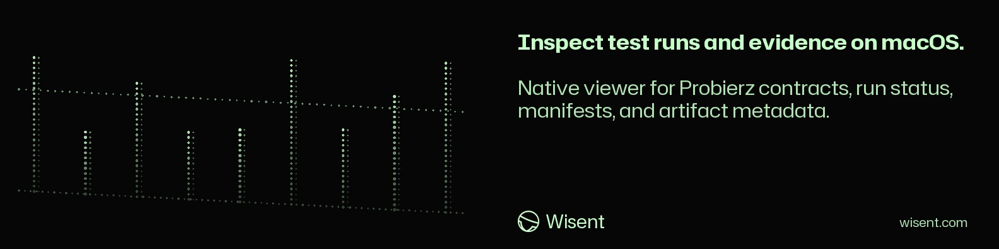

<!-- wisent-banner:start -->
<p align="center">
  
</p>
<!-- wisent-banner:end -->

<!-- wisent-readme-signals:start -->
[](https://github.com/wisent-ai/probierz-desktop) [](https://github.com/wisent-ai/probierz-desktop/issues) [](https://wisent.com) [](https://discord.gg/qRjpkthq54) [](https://www.linkedin.com/company/wisent-ai/) [](https://x.com/wisentai) [](https://calendly.com/lbartoszcze)
<!-- wisent-readme-signals:end -->

# Probierz Desktop

The Best Way to Improve Your AI-Generated Code Is to Have an AI Test It.

Probierz gives you the proof your software works as your AI intended. On every
commit it autonomously creates the journeys of your users and tests them directly
where your product lives. Be it the terminal, the browser, a desktop or mobile
app — Probierz tests it all. Every run gives you the evidence you need — reports,
screenshots and videos so that you can see exactly what is broken in the pipeline.

AI Agent That Tests All of Your Releases. The macOS client inspects evidence
recorded on this machine and can dispatch Probierz's bounded Brama repair for a
failed run. It never edits a run manifest or opens protected artifact contents;
the mutation goes through the canonical `probierz repair` command and publishes
a repair branch or verified spec fix.

[Quick start](#quick-start) · [Inspected contracts](#primary-interfaces) ·
[Safety boundary](#security-and-privacy) ·
[Canonical repository](https://github.com/wisent-ai/probierz-desktop)

Current boundary: public development source for macOS 14+ and Swift 6. A source
build does not promise a signed/notarized public binary, stable release channel,
hosted Probierz service, or managed evidence retention.

## Problem and intended users

Probierz can produce evidence across web, Electron, mobile, and native desktop
surfaces. Before opening large artifacts or invoking the runner, an operator needs
a bounded inventory: are the expected repository contracts present, which
configuration names are set, which recent manifests passed/failed/blocked, and
do referenced artifacts have size and SHA-256 metadata?

Probierz Desktop serves:

- **local developers** checking a Probierz workspace and repairing a failed run;
- **release and quality operators** filtering run summaries by product, target,
  kind, status, and identifier;
- **incident responders** confirming whether local run/artifact metadata is
  present before deeper CLI or filesystem investigation;
- **Wisent identity users** entering the viewer through the shared native auth
  gate.

## Product boundaries

### Included

- native SwiftUI application for macOS 14 or newer;
- `WisentAuth` sign-in gate from `wisent-desktop-auth`;
- deterministic workspace discovery plus explicit workspace selection;
- checks for Probierz package, MCP, history, apps, results, and shared-config
  contracts;
- presence-only reporting for selected environment configuration names;
- bounded recursive discovery of `test-results/**/run-manifest.json`;
- normalized pass, fail, blocked, canceled, and incomplete status summaries;
- run filtering/search and artifact type, size, modification, and hash-presence
  metadata;
- stable Apple Development-signed local app-bundle script.
- one-click repair dispatch for failed runs through the canonical Probierz CLI;

### Explicit non-goals and limitations

- Probierz Desktop does not execute tests, specs, journeys, probes, or device
  actions itself; it delegates repairs to Probierz core.
- It does not author or approve a quality policy or return a gate verdict.
- It does not open, decrypt, render, upload, delete, or verify artifact bytes.
- `hasSHA256` means the manifest contains a non-empty hash field; the viewer does
  not recompute or verify that hash.
- A passed manifest is reported as passed; the viewer does not prove that the
  runner, target, evidence, or result was trustworthy.
- Unknown completed statuses normalize to failed; unknown incomplete statuses
  normalize to incomplete. Consult the canonical manifest for ambiguous cases.
- Traversal is bounded at 100,000 entries and 2,000 manifests and skips symlinks.
  Older or external evidence can be omitted, with truncation surfaced in the UI.
- Configuration display reports whether named environment variables are present,
  not whether their values are correct, safe, reachable, or authorized.
- The app does not connect to a hosted Probierz control plane or retain evidence.

### Supported environment and current capability

| Surface | Requirement | Current state |
|---|---|---|
| Native viewer | macOS 14+, Swift 6 | Implemented source build |
| Identity gate | `wisent-desktop-auth` 0.1.x | Required dependency |
| Workspace | parent containing `probierz/package.json` and `probierz/agent/history.mjs` | Required |
| Run metadata | Probierz `run-manifest.json` contract | Implemented bounded read |
| Artifact content/hash verification | evidence reader/verifier | Not included |
| Test execution/gating | Probierz core | Not included |
| Hosted evidence/control plane | managed Probierz service | Separate surface |

## Core use cases

### Inspect repository contracts

- **Actor:** an authenticated local developer.
- **Initial state:** the selected directory is a Wisent workspace containing the
  Probierz repository boundary.
- **Outcome:** the app shows availability and modification metadata for package,
  MCP, history, apps, result store, and configuration contracts.
- **Boundary:** file presence is not compatibility, executable readiness, or
  evidence that dependencies are installed.

### Review local run history

- **Actor:** a quality or release operator.
- **Initial state:** Probierz has emitted run manifests under `test-results/`.
- **Outcome:** the viewer shows status counts and searchable run ID, app, target,
  kind, times, duration, artifact count, and bytes.
- **Boundary:** no test runs and no result is promoted into a release gate by the
  viewer.

### Inventory artifacts without opening them

- **Actor:** an incident responder or evidence reviewer.
- **Initial state:** manifest artifact paths remain inside each run directory.
- **Outcome:** the app classifies image, video, trace, report, log, protected
  bundle, or other artifacts and reports extension, bytes, modification time, and
  hash-field presence.
- **Boundary:** paths that are absolute, traverse `..`, escape the run directory,
  point to symlinks, or are not regular files are not trusted as local artifacts.

## How Probierz Desktop works

```text
WisentAuth gate
      │
      ▼
SwiftUI metadata viewer
      │ selected Wisent workspace
      ▼
WorkspaceLocator -> <workspace>/probierz
      │
      ├─ contract file/directory checks
      ├─ configuration-name presence
      └─ bounded test-results/**/run-manifest.json scan
                    │
                    ▼
           in-memory ProbierzSnapshot
                    │
                    ▼
       search, status filter, summaries, artifact metadata
```

The local Probierz repository and run manifests remain authoritative. Probierz
core owns execution, evidence, repair dispatch, receipts, and gate evaluation.
The desktop client owns the projection and the explicit repair action only.

## Quick start

The simplest development path runs the desktop client directly from Swift
Package Manager. Test execution remains in Probierz core.

### Prerequisites

- macOS 14 or newer;
- Swift 6 / current Xcode;
- Git;
- a local Wisent workspace containing `probierz/`;
- access to the `wisent-desktop-auth` dependency.

```bash
git clone https://github.com/wisent-ai/probierz-desktop.git
cd probierz-desktop
WISENT_WORKSPACE_ROOT=/absolute/path/to/Wisent swift run ProbierzDesktop
```

Expected result: the app opens the Wisent authentication gate and, after sign-in,
shows the selected local workspace's Probierz metadata. If no valid workspace is
found, choose one in the UI.

Build a stable development-signed app bundle:

```bash
sh Scripts/build-app.sh
open .build/Probierz.app
```

`Scripts/build-app.sh` requires an Apple Development signing identity (or
`WISENT_CODESIGN_IDENTITY`) and refuses ad-hoc signing. By default it restarts the
app only when already running; set `WISENT_RESTART_AFTER_BUILD=0` to disable that
step.

## Primary interfaces

### Workspace discovery

The viewer tries, in order:

1. the path saved under `probierzDesktop.workspaceRoot`;
2. `WISENT_WORKSPACE_ROOT`;
3. current directory;
4. `~/Documents/CodingProjects/Wisent`;
5. bounded ancestors of the application bundle.

A valid workspace contains regular, non-symlink files at:

- `probierz/package.json`;
- `probierz/agent/history.mjs`.

### Contract inventory

| Contract | Relative path |
|---|---|
| Node package | `probierz/package.json` |
| Las MCP surface | `probierz/agent/mcp.mjs` |
| history boundary | `probierz/agent/history.mjs` |
| application surfaces | `probierz/apps/` |
| result store | `probierz/test-results/` |
| shared configuration | `probierz/tsconfig.base.json` |

### Configuration presence

The viewer reports presence—not values—for Android SDK, iOS app/device/version,
Appium, browser path, artifact-encryption key file, color scheme, locale, release,
bundle ID, and workspace-root variables used by local Probierz surfaces.

### Run manifest projection

A manifest may contribute:

- run, application, target, and kind labels;
- status and start/completion timestamps;
- duration;
- artifact relative path, declared bytes, optional SHA-256, and local file
  metadata.

Identifiers longer than 160 characters, empty values, control characters,
unsafe artifact paths, symlinks, and out-of-root paths are rejected or replaced
with an explicit fallback.

## Security and privacy

- Authenticate the UI, but do not treat authentication as filesystem encryption.
- Run under the least-privileged macOS account able to read the selected metadata.
- Run IDs, app/target names, statuses, timings, file types/sizes, and path metadata
  can reveal customer and release activity.
- Do not screen-share or attach viewer screenshots without evidence/data review.
- Artifact contents remain outside this app; inspect them only with the canonical
  Probierz verifier and required decryption/authorization.
- Symlinks and path traversal are rejected, but the selected workspace itself
  must still be trusted.
- The app reads environment-variable presence. Avoid launching it with unrelated
  sensitive process configuration when not required.

## Operational model

- **Configuration:** shared Wisent auth, saved workspace path,
  `WISENT_WORKSPACE_ROOT`, local Probierz conditions, and the Brama router
  coordinates used by `probierz repair`.
- **State:** selected workspace in user defaults; snapshot and repair outcome in memory.
- **Credentials:** owned by `WisentAuth` and the invoked Probierz process; the
  desktop client never reads or displays router or artifact-encryption values.
- **Observability:** contract availability, run evidence, scan truncation,
  refresh errors, and the working/succeeded/failed repair result.
- **Recovery:** select the canonical workspace and refresh; a refused repair
  remains visible and can be retried from the failed run.
- **Cost:** Brama model inference may be consumed by a repair. Hosted execution,
  devices, evidence retention, analytics, and support remain separate costs.

## Project status and support

- **Maturity:** public development operational client for macOS 14+.
- **Distribution:** source build and stable development signing; no supported
  signed/notarized public binary is currently promised.
- **Execution boundary:** evidence projection plus bounded repair dispatch;
  tests and quality decisions stay in Probierz core.
- **Issues:** [`wisent-ai/probierz-desktop`](https://github.com/wisent-ai/probierz-desktop/issues).
- **Security:** use private GitHub Security Advisories; never attach workspace
  paths, run IDs, target names, artifact metadata/content, encryption material,
  or customer evidence to a public issue.
- **License:** Apache License 2.0; see [`LICENSE`](LICENSE).
